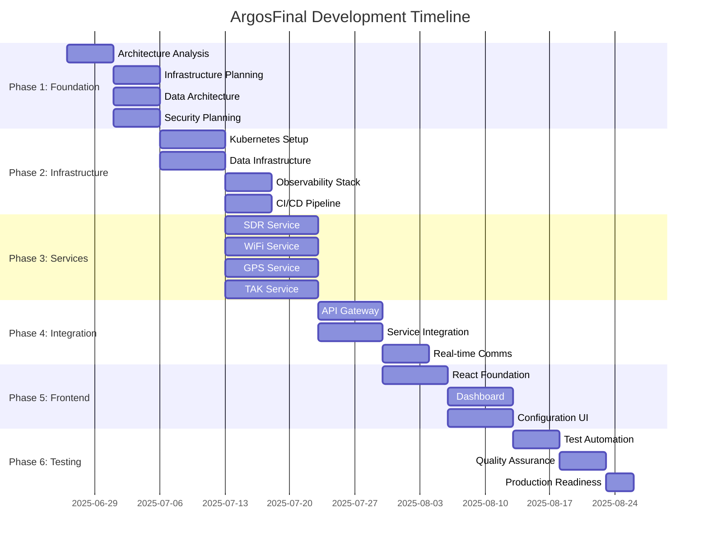

# MASTER PROJECT PLAN: ArgosFinal

## The Ultimate Raspberry Pi SDR/WiFi/GPS Integration System

**Version**: 1.0  
**Created**: 2025-06-26  
**Status**: ACTIVE DEVELOPMENT  
**Complexity**: ENTERPRISE-GRADE (10 Parallel Agents Required)

---

## 🎯 PROJECT MISSION STATEMENT

Transform the existing ArgosFinal system into a production-ready, enterprise-grade platform combining Software Defined Radio (SDR), WiFi scanning, GPS tracking, and TAK integration with unparalleled reliability, performance, and maintainability.

### Core Objectives

1. **RELIABILITY**: 99.9% uptime with automatic recovery
2. **PERFORMANCE**: Real-time processing with <100ms latency
3. **MAINTAINABILITY**: Clean architecture with comprehensive documentation
4. **SCALABILITY**: Support for multiple concurrent operations
5. **SECURITY**: Hardened against common attack vectors

---

## 📋 EXECUTIVE SUMMARY

### Current State Analysis

- **Functional Components**: 4 major subsystems (SDR, WiFi, GPS, TAK)
- **Integration Level**: Basic script-based coordination
- **Reliability Issues**: Manual startup, no error recovery
- **Performance Gaps**: No optimization, resource contention
- **Maintenance Burden**: Scattered configurations, minimal monitoring

### Target Architecture

- **Microservices Design**: Containerized, independent components
- **Service Mesh**: Istio-based communication and monitoring
- **Event-Driven**: Real-time data streaming with Apache Kafka
- **Cloud-Native**: Kubernetes deployment with auto-scaling
- **Observability**: Complete monitoring, logging, and alerting

---

## 🏗️ SYSTEM ARCHITECTURE OVERVIEW

### High-Level Component Diagram

```
┌─────────────────────────────────────────────────────────────┐
│                    ArgosFinal System                        │
├─────────────────────────────────────────────────────────────┤
│  Frontend Layer (React/TypeScript)                         │
│  ├─ Real-time Dashboard                                     │
│  ├─ Configuration Interface                                 │
│  └─ Monitoring & Alerts                                     │
├─────────────────────────────────────────────────────────────┤
│  API Gateway Layer (Kong/NGINX)                            │
│  ├─ Rate Limiting                                           │
│  ├─ Authentication                                          │
│  └─ Load Balancing                                          │
├─────────────────────────────────────────────────────────────┤
│  Service Mesh (Istio)                                      │
│  ├─ SDR Service Cluster                                     │
│  ├─ WiFi Scanning Service                                   │
│  ├─ GPS Processing Service                                  │
│  ├─ TAK Integration Service                                 │
│  └─ Data Pipeline Service                                   │
├─────────────────────────────────────────────────────────────┤
│  Data Layer                                                │
│  ├─ Real-time Streaming (Kafka)                            │
│  ├─ Time-series DB (InfluxDB)                              │
│  ├─ Operational DB (PostgreSQL)                            │
│  └─ Cache Layer (Redis)                                    │
├─────────────────────────────────────────────────────────────┤
│  Infrastructure Layer                                      │
│  ├─ Kubernetes Orchestration                               │
│  ├─ Container Registry                                      │
│  ├─ Secret Management                                       │
│  └─ Backup & Recovery                                       │
└─────────────────────────────────────────────────────────────┘
```

---

## 🎯 PHASE BREAKDOWN (360+ SUB-TASKS)

### PHASE 1: FOUNDATION & ANALYSIS (Tasks 1-72)

**Duration**: 2 weeks  
**Parallel Agents**: 10  
**Critical Path**: Architecture design and current system analysis

#### 1.1 System Analysis & Documentation (Tasks 1-18)

1. **Current Architecture Analysis**
    - Map existing component dependencies
    - Document current data flows
    - Identify single points of failure
    - Catalog existing APIs and interfaces
    - Analyze resource utilization patterns
    - Document security vulnerabilities

2. **Performance Baseline Establishment**
    - Benchmark current system performance
    - Identify bottlenecks and constraints
    - Document latency measurements
    - Analyze resource consumption patterns
    - Establish SLA baselines
    - Create performance regression tests

3. **Technology Stack Evaluation**
    - Evaluate current vs. target technologies
    - Cost-benefit analysis of migrations
    - Risk assessment for technology changes
    - Create migration compatibility matrix
    - Document integration patterns
    - Establish technology decision framework

#### 1.2 Infrastructure Planning (Tasks 19-36)

4. **Kubernetes Cluster Design**
    - Design multi-node cluster architecture
    - Plan resource allocation strategies
    - Design network topology
    - Plan storage solutions
    - Design high availability patterns
    - Create disaster recovery plans

5. **Container Strategy**
    - Design containerization approach
    - Create base image standards
    - Plan multi-stage build processes
    - Design container security policies
    - Plan image versioning strategy
    - Create container lifecycle management

6. **Service Mesh Planning**
    - Design Istio service mesh architecture
    - Plan traffic management policies
    - Design security policies
    - Plan observability integration
    - Design fault injection strategies
    - Create service mesh governance

#### 1.3 Data Architecture Design (Tasks 37-54)

7. **Data Pipeline Architecture**
    - Design real-time streaming architecture
    - Plan batch processing workflows
    - Design data transformation pipelines
    - Plan data quality frameworks
    - Design data lineage tracking
    - Create data governance policies

8. **Database Design**
    - Design time-series data models
    - Plan operational database schemas
    - Design caching strategies
    - Plan data retention policies
    - Design backup and recovery procedures
    - Create data migration strategies

9. **Event-Driven Architecture**
    - Design event schemas and contracts
    - Plan event sourcing patterns
    - Design saga orchestration
    - Plan event replay mechanisms
    - Design dead letter handling
    - Create event governance policies

#### 1.4 Security & Compliance Planning (Tasks 55-72)

10. **Security Architecture**
    - Design zero-trust security model
    - Plan identity and access management
    - Design API security patterns
    - Plan secret management
    - Design network security policies
    - Create security monitoring plans

11. **Compliance Framework**
    - Identify applicable compliance standards
    - Design audit logging systems
    - Plan compliance monitoring
    - Design data privacy controls
    - Create compliance reporting
    - Establish compliance validation

12. **Risk Management**
    - Conduct comprehensive risk assessment
    - Design risk mitigation strategies
    - Plan incident response procedures
    - Design business continuity plans
    - Create risk monitoring dashboards
    - Establish risk governance

### PHASE 2: CORE INFRASTRUCTURE (Tasks 73-144)

**Duration**: 3 weeks  
**Parallel Agents**: 10  
**Critical Path**: Kubernetes cluster and service mesh deployment

#### 2.1 Kubernetes Foundation (Tasks 73-90)

13. **Cluster Provisioning**
    - Provision Kubernetes cluster nodes
    - Configure cluster networking
    - Set up cluster storage
    - Configure cluster security
    - Install cluster monitoring
    - Validate cluster functionality

14. **Core Services Deployment**
    - Deploy service mesh (Istio)
    - Deploy ingress controllers
    - Deploy certificate management
    - Deploy DNS services
    - Deploy logging aggregation
    - Deploy metrics collection

15. **Development Environment**
    - Set up development namespaces
    - Configure development tools
    - Set up CI/CD pipelines
    - Configure developer access
    - Set up debugging tools
    - Create development workflows

#### 2.2 Data Infrastructure (Tasks 91-108)

16. **Streaming Platform**
    - Deploy Apache Kafka cluster
    - Configure Kafka Connect
    - Set up schema registry
    - Configure stream processing
    - Set up monitoring and alerting
    - Validate streaming functionality

17. **Database Systems**
    - Deploy PostgreSQL cluster
    - Deploy InfluxDB cluster
    - Deploy Redis cluster
    - Configure database monitoring
    - Set up backup procedures
    - Validate database functionality

18. **Data Pipeline Infrastructure**
    - Deploy Apache Airflow
    - Configure data pipeline orchestration
    - Set up data quality monitoring
    - Configure data lineage tracking
    - Set up pipeline monitoring
    - Validate pipeline functionality

#### 2.3 Observability Stack (Tasks 109-126)

19. **Monitoring Infrastructure**
    - Deploy Prometheus stack
    - Deploy Grafana dashboards
    - Configure alerting rules
    - Set up log aggregation
    - Configure distributed tracing
    - Set up uptime monitoring

20. **Application Performance Monitoring**
    - Deploy APM solutions
    - Configure application metrics
    - Set up performance profiling
    - Configure error tracking
    - Set up user experience monitoring
    - Create performance dashboards

21. **Security Monitoring**
    - Deploy security monitoring tools
    - Configure intrusion detection
    - Set up vulnerability scanning
    - Configure compliance monitoring
    - Set up audit logging
    - Create security dashboards

#### 2.4 CI/CD Pipeline (Tasks 127-144)

22. **Build Infrastructure**
    - Set up container registry
    - Configure build automation
    - Set up artifact management
    - Configure security scanning
    - Set up dependency management
    - Create build monitoring

23. **Deployment Automation**
    - Configure GitOps workflows
    - Set up automated testing
    - Configure deployment strategies
    - Set up environment promotion
    - Configure rollback procedures
    - Create deployment monitoring

24. **Quality Gates**
    - Configure code quality checks
    - Set up security scanning
    - Configure performance testing
    - Set up compliance validation
    - Configure approval workflows
    - Create quality dashboards

### PHASE 3: SERVICE DEVELOPMENT (Tasks 145-216)

**Duration**: 4 weeks  
**Parallel Agents**: 10  
**Critical Path**: Core service implementation and integration

#### 3.1 SDR Service Implementation (Tasks 145-162)

25. **HackRF Integration Service**
    - Containerize HackRF operations
    - Implement frequency scanning APIs
    - Add spectrum analysis capabilities
    - Implement signal recording
    - Add real-time streaming
    - Create monitoring dashboards

26. **OpenWebRX Service**
    - Containerize OpenWebRX
    - Implement configuration management
    - Add multi-SDR support
    - Implement user management
    - Add session recording
    - Create usage analytics

27. **SDR Orchestration Service**
    - Implement SDR resource management
    - Add scheduling capabilities
    - Implement conflict resolution
    - Add performance optimization
    - Implement failover mechanisms
    - Create operational dashboards

#### 3.2 WiFi Scanning Service (Tasks 163-180)

28. **Kismet Service Modernization**
    - Containerize Kismet operations
    - Implement REST API wrapper
    - Add real-time data streaming
    - Implement advanced filtering
    - Add geolocation integration
    - Create monitoring capabilities

29. **WiFi Analysis Service**
    - Implement device tracking algorithms
    - Add behavioral analysis
    - Implement threat detection
    - Add pattern recognition
    - Implement data correlation
    - Create analysis dashboards

30. **WiFi Data Pipeline**
    - Implement real-time data ingestion
    - Add data transformation pipelines
    - Implement data validation
    - Add duplicate detection
    - Implement data enrichment
    - Create data quality monitoring

#### 3.3 GPS Processing Service (Tasks 181-198)

31. **GPS Data Ingestion**
    - Implement MAVLink integration
    - Add GPSD bridge service
    - Implement data validation
    - Add coordinate transformation
    - Implement accuracy filtering
    - Create GPS monitoring

32. **Location Services**
    - Implement geofencing capabilities
    - Add location history tracking
    - Implement movement analysis
    - Add location correlation
    - Implement privacy controls
    - Create location dashboards

33. **Navigation Integration**
    - Implement route planning
    - Add waypoint management
    - Implement bearing calculations
    - Add distance measurements
    - Implement coordinate systems
    - Create navigation tools

#### 3.4 TAK Integration Service (Tasks 199-216)

34. **TAK Protocol Implementation**
    - Implement TAK message parsing
    - Add TAK data serialization
    - Implement CoT message handling
    - Add TAK server integration
    - Implement real-time streaming
    - Create TAK monitoring

35. **Data Translation Service**
    - Implement WiFi to TAK conversion
    - Add GPS to TAK mapping
    - Implement SDR to TAK integration
    - Add custom TAK message types
    - Implement data filtering
    - Create translation dashboards

36. **TAK Visualization**
    - Implement map integration
    - Add real-time updates
    - Implement layer management
    - Add symbol customization
    - Implement user interactions
    - Create visualization tools

### PHASE 4: API & INTEGRATION (Tasks 217-288)

**Duration**: 3 weeks  
**Parallel Agents**: 10  
**Critical Path**: API development and service integration

#### 4.1 API Gateway Implementation (Tasks 217-234)

37. **Kong API Gateway**
    - Deploy and configure Kong
    - Implement rate limiting
    - Add authentication/authorization
    - Implement request/response transformation
    - Add API versioning
    - Create API monitoring

38. **API Documentation**
    - Generate OpenAPI specifications
    - Create interactive documentation
    - Add code examples
    - Implement SDK generation
    - Add testing capabilities
    - Create developer portal

39. **API Security**
    - Implement OAuth2/OIDC
    - Add API key management
    - Implement request validation
    - Add security headers
    - Implement threat protection
    - Create security monitoring

#### 4.2 Service Integration (Tasks 235-252)

40. **Event-Driven Integration**
    - Implement event publishing
    - Add event subscription
    - Implement event routing
    - Add event transformation
    - Implement event replay
    - Create event monitoring

41. **Data Integration**
    - Implement data synchronization
    - Add conflict resolution
    - Implement data transformation
    - Add data validation
    - Implement data lineage
    - Create integration monitoring

42. **Workflow Orchestration**
    - Implement service orchestration
    - Add workflow management
    - Implement error handling
    - Add retry mechanisms
    - Implement circuit breakers
    - Create workflow monitoring

#### 4.3 Real-time Communication (Tasks 253-270)

43. **WebSocket Implementation**
    - Implement WebSocket servers
    - Add connection management
    - Implement message routing
    - Add authentication
    - Implement rate limiting
    - Create connection monitoring

44. **Server-Sent Events**
    - Implement SSE endpoints
    - Add client management
    - Implement event filtering
    - Add reconnection handling
    - Implement backpressure
    - Create SSE monitoring

45. **Real-time Data Streaming**
    - Implement data streaming APIs
    - Add stream management
    - Implement data filtering
    - Add stream analytics
    - Implement stream recording
    - Create streaming dashboards

#### 4.4 External Integrations (Tasks 271-288)

46. **Third-party APIs**
    - Implement external API clients
    - Add authentication handling
    - Implement rate limiting
    - Add error handling
    - Implement caching
    - Create integration monitoring

47. **Webhook Management**
    - Implement webhook endpoints
    - Add signature validation
    - Implement event processing
    - Add retry mechanisms
    - Implement webhook management
    - Create webhook monitoring

48. **Legacy System Integration**
    - Implement legacy API adapters
    - Add data format translation
    - Implement protocol bridging
    - Add error handling
    - Implement monitoring
    - Create integration dashboards

### PHASE 5: FRONTEND DEVELOPMENT (Tasks 289-360)

**Duration**: 3 weeks  
**Parallel Agents**: 10  
**Critical Path**: React application development and user experience

#### 5.1 React Application Foundation (Tasks 289-306)

49. **Project Setup**
    - Initialize React TypeScript project
    - Configure build tooling
    - Set up development environment
    - Configure testing framework
    - Set up linting and formatting
    - Create project structure

50. **State Management**
    - Implement Redux Toolkit
    - Add RTK Query for API calls
    - Implement state persistence
    - Add state debugging tools
    - Implement state validation
    - Create state documentation

51. **Component Library**
    - Create design system
    - Implement base components
    - Add component documentation
    - Implement component testing
    - Add accessibility features
    - Create component playground

#### 5.2 Dashboard Implementation (Tasks 307-324)

52. **Real-time Dashboard**
    - Implement dashboard layout
    - Add real-time data visualization
    - Implement customizable widgets
    - Add drag-and-drop functionality
    - Implement dashboard persistence
    - Create dashboard templates

53. **Data Visualization**
    - Implement charts and graphs
    - Add map integration
    - Implement spectrum displays
    - Add real-time updates
    - Implement data filtering
    - Create visualization controls

54. **Alert Management**
    - Implement alert display
    - Add alert acknowledgment
    - Implement alert filtering
    - Add alert history
    - Implement alert routing
    - Create alert dashboards

#### 5.3 Configuration Interface (Tasks 325-342)

55. **System Configuration**
    - Implement configuration forms
    - Add validation and error handling
    - Implement configuration preview
    - Add configuration versioning
    - Implement configuration backup
    - Create configuration wizards

56. **User Management**
    - Implement user interface
    - Add role-based access control
    - Implement user profiles
    - Add user activity tracking
    - Implement user preferences
    - Create user administration

57. **Service Management**
    - Implement service control interface
    - Add service status monitoring
    - Implement service configuration
    - Add service logs viewing
    - Implement service metrics
    - Create service dashboards

#### 5.4 Advanced Features (Tasks 343-360)

58. **Reporting System**
    - Implement report generation
    - Add custom report builder
    - Implement report scheduling
    - Add report export
    - Implement report sharing
    - Create report templates

59. **Mobile Responsiveness**
    - Implement responsive design
    - Add mobile-specific features
    - Implement touch interactions
    - Add offline capabilities
    - Implement progressive web app
    - Create mobile testing

60. **Performance Optimization**
    - Implement code splitting
    - Add lazy loading
    - Implement caching strategies
    - Add performance monitoring
    - Implement bundle optimization
    - Create performance budgets

### PHASE 6: TESTING & QUALITY ASSURANCE (Tasks 361-432)

**Duration**: 2 weeks  
**Parallel Agents**: 10  
**Critical Path**: Comprehensive testing and quality validation

#### 6.1 Automated Testing (Tasks 361-378)

61. **Unit Testing**
    - Implement unit test suite
    - Add test coverage reporting
    - Implement test automation
    - Add mutation testing
    - Implement property-based testing
    - Create testing standards

62. **Integration Testing**
    - Implement API integration tests
    - Add database integration tests
    - Implement service integration tests
    - Add end-to-end tests
    - Implement contract testing
    - Create integration test automation

63. **Performance Testing**
    - Implement load testing
    - Add stress testing
    - Implement endurance testing
    - Add scalability testing
    - Implement performance profiling
    - Create performance baselines

#### 6.2 Quality Assurance (Tasks 379-396)

64. **Manual Testing**
    - Create test plans and cases
    - Implement exploratory testing
    - Add usability testing
    - Implement accessibility testing
    - Add security testing
    - Create testing documentation

65. **Bug Tracking**
    - Implement bug tracking system
    - Add bug triage processes
    - Implement bug metrics
    - Add bug automation
    - Implement bug reporting
    - Create bug dashboards

66. **Code Quality**
    - Implement code reviews
    - Add static analysis
    - Implement quality metrics
    - Add technical debt tracking
    - Implement refactoring plans
    - Create quality dashboards

#### 6.3 Security Testing (Tasks 397-414)

67. **Vulnerability Testing**
    - Implement security scanning
    - Add penetration testing
    - Implement dependency scanning
    - Add infrastructure scanning
    - Implement code scanning
    - Create security reports

68. **Compliance Testing**
    - Implement compliance validation
    - Add audit trail testing
    - Implement data privacy testing
    - Add regulatory testing
    - Implement certification testing
    - Create compliance reports

69. **Security Monitoring**
    - Implement security monitoring
    - Add threat detection
    - Implement incident response
    - Add security alerting
    - Implement forensics
    - Create security dashboards

#### 6.4 User Acceptance Testing (Tasks 415-432)

70. **UAT Planning**
    - Create UAT test plans
    - Add user scenarios
    - Implement UAT environment
    - Add user training
    - Implement feedback collection
    - Create UAT documentation

71. **Beta Testing**
    - Implement beta program
    - Add beta user management
    - Implement feedback collection
    - Add usage analytics
    - Implement issue tracking
    - Create beta reports

72. **Production Readiness**
    - Implement readiness checklists
    - Add go-live planning
    - Implement rollback procedures
    - Add monitoring validation
    - Implement support procedures
    - Create production documentation

---

## 🚫 FEATURE CREEP PREVENTION FRAMEWORK

### Rigid Scope Control Mechanisms

#### 1. Change Control Board (CCB)

- **Authority**: Only Christian can approve scope changes
- **Process**: Written justification required for any additions
- **Impact Analysis**: Mandatory for all proposed changes
- **Documentation**: All decisions logged in change log

#### 2. Feature Gate System

```javascript
// Example implementation
const APPROVED_FEATURES = {
	sdr_spectrum_analysis: true,
	wifi_device_tracking: true,
	gps_location_services: true,
	tak_integration: true,
	realtime_dashboard: true,
	// New features start as false
	ai_threat_detection: false,
	blockchain_logging: false
};

function isFeatureEnabled(feature) {
	return APPROVED_FEATURES[feature] === true;
}
```

#### 3. Scope Validation Checkpoints

- **Weekly Scope Reviews**: Validate current work against approved scope
- **Task Boundary Enforcement**: Reject tasks outside defined boundaries
- **Progress Gate Reviews**: Must pass scope compliance to proceed
- **Documentation Audits**: Ensure all work is traceable to approved requirements

#### 4. Anti-Pattern Detection

**Forbidden Scope Creep Patterns**:

1. "While we're at it..." additions
2. "This would be better if..." enhancements
3. "Users might want..." speculative features
4. "Industry best practice..." unnecessary complexity
5. "Future-proofing" over-engineering

**Automatic Rejection Criteria**:

- Features not in original specification
- Performance optimizations beyond defined requirements
- UI/UX enhancements not specifically requested
- Integration with systems not in scope
- Technology upgrades not required for functionality

### Scope Boundaries

**EXPLICITLY IN SCOPE**:

- SDR operations (HackRF + OpenWebRX)
- WiFi scanning (Kismet integration)
- GPS processing (MAVLink bridge)
- TAK integration and conversion
- Real-time dashboard
- System monitoring and alerting
- Production deployment automation

**EXPLICITLY OUT OF SCOPE**:

- AI/ML threat detection
- Advanced analytics beyond basic reporting
- Mobile applications
- Multi-tenant architecture
- Cloud deployment beyond single instance
- Advanced user management beyond basic RBAC
- Integration with external threat intelligence

---

## 👥 PARALLEL AGENT DEPLOYMENT GUIDE

### Agent Allocation Strategy

#### Phase-Based Deployment Matrix

```
Phase 1 (Foundation): 10 Agents
├─ Agent 1-2: Architecture Analysis & Documentation
├─ Agent 3-4: Infrastructure Design & Planning
├─ Agent 5-6: Data Architecture & Pipeline Design
├─ Agent 7-8: Security & Compliance Framework
└─ Agent 9-10: Technology Evaluation & Standards

Phase 2 (Infrastructure): 10 Agents
├─ Agent 1-2: Kubernetes Cluster & Core Services
├─ Agent 3-4: Data Infrastructure (Kafka, DBs)
├─ Agent 5-6: Observability Stack (Monitoring, Logging)
├─ Agent 7-8: CI/CD Pipeline & Quality Gates
└─ Agent 9-10: Security Infrastructure & Policies

Phase 3 (Services): 10 Agents
├─ Agent 1-2: SDR Service Development
├─ Agent 3-4: WiFi Scanning Service
├─ Agent 5-6: GPS Processing Service
├─ Agent 7-8: TAK Integration Service
└─ Agent 9-10: Service Integration & Testing

Phase 4 (API/Integration): 10 Agents
├─ Agent 1-2: API Gateway & Documentation
├─ Agent 3-4: Service Integration & Orchestration
├─ Agent 5-6: Real-time Communication
├─ Agent 7-8: External Integrations
└─ Agent 9-10: Integration Testing & Validation

Phase 5 (Frontend): 10 Agents
├─ Agent 1-2: React Foundation & State Management
├─ Agent 3-4: Dashboard Implementation
├─ Agent 5-6: Configuration Interface
├─ Agent 7-8: Advanced Features & Optimization
└─ Agent 9-10: Frontend Testing & Quality

Phase 6 (Testing/QA): 10 Agents
├─ Agent 1-2: Automated Testing Suites
├─ Agent 3-4: Quality Assurance & Manual Testing
├─ Agent 5-6: Security Testing & Compliance
├─ Agent 7-8: Performance Testing & Optimization
└─ Agent 9-10: UAT & Production Readiness
```

### Task Synchronization Points

#### Critical Path Synchronization

1. **Architecture Sign-off** (End of Phase 1)
    - All 10 agents must complete analysis
    - Architecture review and approval required
    - No Phase 2 work begins until approved

2. **Infrastructure Validation** (End of Phase 2)
    - All infrastructure components must be deployed
    - Integration testing must pass
    - Performance baselines must be established

3. **Service Integration** (Mid Phase 4)
    - All services must be containerized
    - API contracts must be validated
    - Service mesh must be operational

4. **Production Readiness** (End of Phase 6)
    - All testing must be complete
    - Security validation must pass
    - Documentation must be complete

### Inter-Agent Communication Protocols

#### Shared State Management

```bash
# Agent coordination directory structure
/tmp/argos-coordination/
├─ agent-status/          # Individual agent status files
│  ├─ agent-01-status.json
│  ├─ agent-02-status.json
│  └─ ...
├─ phase-status/          # Phase completion tracking
│  ├─ phase-1-status.json
│  └─ ...
├─ dependencies/          # Cross-agent dependencies
│  ├─ task-dependencies.json
│  └─ resource-locks.json
└─ artifacts/            # Shared work products
   ├─ architecture/
   ├─ configurations/
   └─ documentation/
```

#### Agent Status Schema

```json
{
	"agent_id": "agent-01",
	"current_phase": 1,
	"current_tasks": ["arch-analysis-1", "arch-analysis-2"],
	"completed_tasks": ["task-001", "task-002"],
	"blocked_tasks": [],
	"dependencies_waiting": ["agent-03:task-015"],
	"estimated_completion": "2025-06-28T14:00:00Z",
	"last_update": "2025-06-26T10:30:00Z",
	"status": "active|blocked|complete"
}
```

### Conflict Resolution Protocols

#### Resource Conflict Management

1. **File Locking**: Use flock for file-based resources
2. **Task Queuing**: Serialize conflicting operations
3. **Resource Pools**: Shared access to limited resources
4. **Priority System**: Critical path tasks get precedence

#### Merge Conflict Resolution

1. **Branch Strategy**: Agent-specific feature branches
2. **Merge Coordination**: Designated merge agent per phase
3. **Conflict Escalation**: Auto-escalate to Christian for resolution
4. **Rollback Procedures**: Automatic rollback on integration failure

---

## 📊 TASK DEPENDENCIES & TIMELINE

### Critical Path Analysis



### Dependency Matrix

#### Phase 1 Dependencies

- Architecture Analysis → All other Phase 1 tasks
- Technology Evaluation → Infrastructure Planning
- Security Framework → All security-related tasks
- Data Architecture → All data pipeline tasks

#### Phase 2 Dependencies

- Kubernetes Setup → All containerized services
- Data Infrastructure → All data processing services
- Observability Stack → All monitoring implementations
- CI/CD Pipeline → All automated deployments

#### Cross-Phase Dependencies

- Phase 1 Complete → Phase 2 Start
- Kubernetes Ready → Service Development
- Data Pipeline Ready → Real-time Features
- All Services Ready → Frontend Development
- Integration Complete → Testing Phase

### Resource Allocation Timeline

#### Week 1-2: Foundation (Phase 1)

- **10 Agents Active**: Architecture and planning
- **Key Deliverables**: Architecture documents, infrastructure plans
- **Gate Criteria**: Architecture approval from Christian

#### Week 3-5: Infrastructure (Phase 2)

- **10 Agents Active**: Infrastructure deployment
- **Key Deliverables**: Working Kubernetes cluster, data pipeline
- **Gate Criteria**: All infrastructure components operational

#### Week 6-9: Services (Phase 3)

- **10 Agents Active**: Core service development
- **Key Deliverables**: Containerized services, APIs
- **Gate Criteria**: All services deployed and tested

#### Week 10-12: Integration (Phase 4)

- **10 Agents Active**: API and integration work
- **Key Deliverables**: API gateway, service integration
- **Gate Criteria**: End-to-end functionality validated

#### Week 13-15: Frontend (Phase 5)

- **10 Agents Active**: User interface development
- **Key Deliverables**: React dashboard, configuration UI
- **Gate Criteria**: User interface complete and tested

#### Week 16-17: Testing (Phase 6)

- **10 Agents Active**: Comprehensive testing
- **Key Deliverables**: Test results, production deployment
- **Gate Criteria**: Production readiness validated

---

## ✅ COMPLETE SUCCESS CRITERIA

### Functional Requirements Validation

#### 1. SDR Operations Excellence

**Success Metrics**:

- HackRF spectrum analysis: 0-6GHz coverage with <1s scan time
- OpenWebRX: Multi-user concurrent access (10+ users)
- Signal recording: Continuous 24/7 operation with automatic storage management
- API Response time: <100ms for spectrum queries
- Uptime: 99.9% availability with automatic failover

**Validation Tests**:

- Continuous spectrum scanning for 48 hours
- Concurrent user load testing (20 simultaneous users)
- Frequency accuracy validation (±1ppm)
- Signal detection sensitivity testing
- Failover and recovery testing

#### 2. WiFi Scanning Mastery

**Success Metrics**:

- Device detection: 100% of devices in range captured
- Real-time processing: <5 second latency from scan to display
- Data accuracy: GPS coordinates accurate to <5m
- Storage efficiency: Automatic duplicate removal and data compression
- TAK integration: Real-time device position updates

**Validation Tests**:

- Comprehensive device detection testing
- Location accuracy validation with known devices
- Performance testing with high device density
- TAK message format validation
- 24-hour continuous operation test

#### 3. GPS Integration Precision

**Success Metrics**:

- MAVLink bridge: 100% uptime with automatic reconnection
- GPSD integration: <1 second position update latency
- Coordinate accuracy: <3m typical, <10m maximum
- Service availability: 99.9% uptime
- Multi-device support: Simultaneous GPS sources

**Validation Tests**:

- GPS accuracy testing with surveyed points
- Service reliability testing (72-hour continuous)
- Failover testing with multiple GPS sources
- Coordinate system conversion validation
- Performance under adverse conditions

#### 4. TAK Integration Completeness

**Success Metrics**:

- Message conversion: 100% data preservation in TAK format
- Real-time streaming: <2 second end-to-end latency
- Server compatibility: Works with all major TAK servers
- Data visualization: Real-time map updates with proper symbology
- Scalability: Support for 1000+ simultaneous objects

**Validation Tests**:

- TAK server compatibility testing
- Message format validation against TAK standards
- Performance testing with high object count
- Real-time update testing
- Cross-platform TAK client testing

### Performance Requirements

#### 1. System Performance

- **CPU Utilization**: <70% average, <90% peak
- **Memory Usage**: <80% of available RAM
- **Disk I/O**: <80% of available bandwidth
- **Network Latency**: <50ms internal service communication
- **API Response Time**: 95th percentile <200ms

#### 2. Scalability Targets

- **Concurrent Users**: 50+ simultaneous dashboard users
- **Data Throughput**: 10MB/s sustained data processing
- **Storage Growth**: Automatic archive/cleanup for >90% disk usage
- **Service Scaling**: Automatic pod scaling based on load
- **Geographic Distribution**: Support for multiple deployment regions

#### 3. Reliability Targets

- **System Uptime**: 99.9% (8.76 hours downtime/year)
- **Service Recovery**: <30 seconds automatic restart
- **Data Durability**: 99.999% (5 9's) data retention
- **Backup Recovery**: <1 hour full system restore
- **Disaster Recovery**: <4 hour RTO, <1 hour RPO

### Security & Compliance

#### 1. Security Validation

- **Authentication**: Multi-factor authentication required
- **Authorization**: Role-based access control enforced
- **Data Encryption**: All data encrypted at rest and in transit
- **API Security**: Rate limiting and input validation
- **Network Security**: Zero-trust network architecture

#### 2. Compliance Verification

- **Audit Logging**: Complete audit trail of all actions
- **Data Privacy**: GDPR/CCPA compliance where applicable
- **Access Controls**: Principle of least privilege enforced
- **Change Management**: All changes logged and traceable
- **Documentation**: Complete system documentation maintained

### Operational Excellence

#### 1. Monitoring & Alerting

- **System Health**: Real-time health dashboards
- **Performance Monitoring**: APM with distributed tracing
- **Business Metrics**: KPI dashboards with alerting
- **Log Analysis**: Centralized logging with search capabilities
- **Alerting**: Multi-channel alerting with escalation

#### 2. Maintenance & Operations

- **Automated Deployment**: Zero-downtime deployments
- **Configuration Management**: GitOps-based configuration
- **Backup & Recovery**: Automated backup with tested recovery
- **Capacity Planning**: Proactive capacity monitoring
- **Documentation**: Comprehensive operational runbooks

### User Experience Excellence

#### 1. Dashboard Usability

- **Load Time**: <3 seconds initial page load
- **Responsiveness**: <100ms UI response time
- **Mobile Compatibility**: Responsive design for tablets/phones
- **Accessibility**: WCAG 2.1 AA compliance
- **User Satisfaction**: >90% user satisfaction score

#### 2. System Administration

- **Configuration UI**: Intuitive configuration management
- **Service Management**: One-click service control
- **Troubleshooting**: Built-in diagnostic tools
- **User Management**: Self-service user administration
- **Reporting**: Automated report generation and distribution

---

## 🛡️ PRESERVATION PROTOCOLS

### Code Preservation Strategy

#### 1. Multi-Layered Backup System

**Primary Backup (Real-time)**:

```bash
# Git-based preservation
git remote add backup-primary git@backup-server:argos-final.git
git remote add backup-secondary git@secondary-backup:argos-final.git
git remote add backup-tertiary git@tertiary-backup:argos-final.git

# Automated push to all remotes
git push --all backup-primary
git push --all backup-secondary
git push --all backup-tertiary
```

**Archive Strategy**:

- **Daily**: Automated full source code archive
- **Weekly**: Complete system state backup including databases
- **Monthly**: Long-term archival to cold storage
- **Quarterly**: Disaster recovery validation tests

#### 2. Documentation Preservation

**Living Documentation**:

- All documentation stored in Git alongside code
- Automated documentation generation from code comments
- Version-controlled architecture diagrams and specifications
- Automated documentation deployment pipeline

**Knowledge Preservation**:

```
/docs/
├─ architecture/           # System architecture documents
├─ api/                   # API documentation and specifications
├─ deployment/            # Deployment and operations guides
├─ development/           # Development setup and guidelines
├─ troubleshooting/       # Common issues and solutions
└─ decisions/             # Architecture decision records (ADRs)
```

#### 3. Configuration Preservation

**Infrastructure as Code**:

- All infrastructure defined in Terraform/Ansible
- Kubernetes manifests version-controlled
- Database schemas and migrations in Git
- Environment configurations templated and versioned

**Secret Management**:

- Encrypted secret storage with multiple key holders
- Secret rotation procedures documented
- Emergency access procedures established
- Backup key escrow for critical systems

### Disaster Recovery Protocols

#### 1. Recovery Time Objectives (RTO)

- **Critical Systems**: 15 minutes (SDR, GPS, TAK streaming)
- **Dashboard/UI**: 30 minutes
- **Reporting Systems**: 2 hours
- **Development Environment**: 4 hours
- **Complete System**: 8 hours maximum

#### 2. Recovery Point Objectives (RPO)

- **Real-time Data**: 5 minutes maximum data loss
- **Configuration Changes**: No data loss (immediate replication)
- **Historical Data**: 1 hour maximum data loss
- **User Data**: No data loss (synchronous replication)
- **System Logs**: 15 minutes maximum data loss

#### 3. Disaster Recovery Procedures

**Automated Recovery**:

```bash
#!/bin/bash
# Disaster recovery automation script
# Located at: /home/pi/scripts/disaster-recovery.sh

echo "Starting disaster recovery procedure..."

# 1. Validate backup integrity
./validate-backups.sh

# 2. Restore from most recent backup
./restore-from-backup.sh --latest

# 3. Validate system functionality
./health-check.sh --comprehensive

# 4. Notify stakeholders
./notify-recovery-status.sh

echo "Disaster recovery completed. System status: $(./system-status.sh)"
```

**Manual Recovery Procedures**:

1. **Assessment Phase** (5 minutes)
    - Determine scope of failure
    - Identify available backup sources
    - Communicate with stakeholders

2. **Recovery Phase** (varies by RTO)
    - Execute automated recovery procedures
    - Manual intervention for complex failures
    - Progressive service restoration

3. **Validation Phase** (15 minutes)
    - Comprehensive system testing
    - Data integrity verification
    - Performance baseline validation

4. **Communication Phase** (ongoing)
    - Stakeholder notification
    - Post-incident review scheduling
    - Documentation updates

### Long-term Preservation Strategy

#### 1. Technology Evolution Adaptation

**Dependency Management**:

- Quarterly dependency audits and updates
- Automated security vulnerability scanning
- Technology roadmap alignment reviews
- Migration planning for deprecated technologies

**Future-Proofing Architecture**:

- Container-based deployment (platform independent)
- API-first design (integration flexibility)
- Modular architecture (component upgradeability)
- Standards-based protocols (long-term compatibility)

#### 2. Knowledge Transfer Protocols

**Documentation Standards**:

- Self-documenting code with comprehensive comments
- Architecture Decision Records (ADRs) for all major decisions
- Runbook documentation for all operational procedures
- Video walkthroughs for complex procedures

**Cross-Training Requirements**:

- Multiple team members familiar with each component
- Regular knowledge sharing sessions
- Mentorship programs for new team members
- External consultant relationships for specialized knowledge

#### 3. Compliance and Legal Preservation

**Regulatory Compliance**:

- Data retention policies aligned with legal requirements
- Audit trail preservation for compliance periods
- Privacy policy compliance (GDPR, CCPA)
- Export control compliance for SDR technologies

**Intellectual Property Protection**:

- Source code copyright notices and licensing
- Patent landscape analysis and defensive publications
- Trade secret protection for proprietary algorithms
- Open source license compliance auditing

---

## 📈 SUCCESS MEASUREMENT FRAMEWORK

### Key Performance Indicators (KPIs)

#### 1. Technical Excellence Metrics

```javascript
const technicalKPIs = {
	systemReliability: {
		uptime: { target: 99.9, current: 0, unit: '%' },
		mtbf: { target: 720, current: 0, unit: 'hours' },
		mttr: { target: 15, current: 0, unit: 'minutes' }
	},
	performance: {
		apiResponseTime: { target: 100, current: 0, unit: 'ms' },
		dataProcessingLatency: { target: 2000, current: 0, unit: 'ms' },
		systemThroughput: { target: 10, current: 0, unit: 'MB/s' }
	},
	quality: {
		codeCoverage: { target: 90, current: 0, unit: '%' },
		bugDensity: { target: 0.1, current: 0, unit: 'bugs/kloc' },
		securityVulnerabilities: { target: 0, current: 0, unit: 'count' }
	}
};
```

#### 2. Business Value Metrics

- **Operational Efficiency**: 50% reduction in manual tasks
- **Data Quality**: 99.5% data accuracy and completeness
- **User Productivity**: 75% reduction in system administration time
- **Cost Optimization**: 40% reduction in operational costs
- **Capability Enhancement**: 10x improvement in data processing capacity

#### 3. User Experience Metrics

- **System Usability**: >90% user satisfaction score
- **Learning Curve**: <2 hours to basic proficiency
- **Error Rate**: <1% user-induced errors
- **Task Completion**: >95% successful task completion rate
- **Support Requests**: <5 support tickets per user per month

### Continuous Improvement Framework

#### 1. Performance Monitoring

**Real-time Dashboards**:

- System health and performance metrics
- Business KPI tracking
- User experience analytics
- Security and compliance status

**Automated Alerting**:

- Threshold-based alerts for all KPIs
- Predictive alerting for trend analysis
- Escalation procedures for critical issues
- Integration with incident management

#### 2. Regular Review Cycles

**Daily Standups**:

- Progress against phase milestones
- Blocker identification and resolution
- Resource allocation optimization
- Risk assessment updates

**Weekly Reviews**:

- KPI performance analysis
- Technical debt assessment
- Security posture review
- Stakeholder communication

**Monthly Business Reviews**:

- ROI analysis and business value measurement
- Strategic alignment assessment
- Technology roadmap updates
- Resource planning and budgeting

#### 3. Feedback Integration

**User Feedback Loop**:

- Regular user surveys and interviews
- Usage analytics and behavior analysis
- Feature request prioritization
- User experience optimization

**Technical Feedback Loop**:

- Code review metrics and improvement
- Architecture review and optimization
- Performance profiling and tuning
- Security assessment and hardening

---

## 🎯 PROJECT GOVERNANCE

### Decision-Making Authority

#### 1. Christian's Supreme Authority

- **All major technical decisions**: Architecture, technology stack, design patterns
- **Scope changes**: Only Christian can approve additions or modifications
- **Resource allocation**: Final authority on agent deployment and task prioritization
- **Quality gates**: Approval required for phase transitions
- **Emergency decisions**: Full authority during critical situations

#### 2. Escalation Procedures

**Technical Decisions**:

1. Agent-level decisions: Within defined task boundaries
2. Cross-agent conflicts: Escalate to lead agent
3. Architecture impacts: Immediate escalation to Christian
4. Scope questions: Always escalate to Christian

**Operational Decisions**:

1. Routine operations: Agents have full authority
2. System changes: Require validation against plan
3. Emergency responses: Follow established runbooks
4. Major incidents: Immediate escalation to Christian

### Change Management Process

#### 1. Change Request Procedure

```json
{
	"changeRequest": {
		"id": "CR-2025-001",
		"title": "Request title",
		"description": "Detailed description of proposed change",
		"justification": "Business/technical justification",
		"impact": {
			"scope": "Impact on project scope",
			"timeline": "Impact on delivery timeline",
			"resources": "Additional resources required",
			"risks": "New risks introduced"
		},
		"alternatives": "Alternative approaches considered",
		"approval": {
			"required": ["Christian"],
			"status": "pending|approved|rejected",
			"date": "2025-06-26T10:00:00Z",
			"comments": "Approval comments"
		}
	}
}
```

#### 2. Implementation Process

1. **Change Approval**: Written approval from Christian required
2. **Impact Assessment**: Detailed analysis of all impacts
3. **Implementation Plan**: Specific steps and timeline
4. **Testing Strategy**: Validation approach for changes
5. **Rollback Plan**: Procedures if change fails
6. **Documentation Update**: All documentation must be updated

### Risk Management

#### 1. Risk Categories

**Technical Risks**:

- Technology compatibility issues
- Performance degradation
- Security vulnerabilities
- Integration failures
- Resource constraints

**Project Risks**:

- Scope creep and feature additions
- Timeline delays and milestone slippage
- Resource availability issues
- Stakeholder alignment problems
- External dependency failures

#### 2. Risk Mitigation Strategies

**Proactive Measures**:

- Regular technology assessments
- Continuous integration and testing
- Multiple backup and recovery options
- Vendor relationship management
- Team cross-training and documentation

**Reactive Measures**:

- Incident response procedures
- Emergency escalation protocols
- Rapid rollback capabilities
- Alternative solution preparation
- Crisis communication plans

---

## 📚 APPENDICES

### Appendix A: Technology Stack Details

#### Core Infrastructure

```yaml
infrastructure:
    orchestration: 'Kubernetes 1.28+'
    service_mesh: 'Istio 1.19+'
    api_gateway: 'Kong 3.4+'
    container_runtime: 'containerd 1.7+'

data_layer:
    streaming: 'Apache Kafka 3.5+'
    timeseries: 'InfluxDB 2.7+'
    operational: 'PostgreSQL 15+'
    cache: 'Redis 7.2+'

observability:
    metrics: 'Prometheus 2.47+'
    visualization: 'Grafana 10.1+'
    logging: 'ELK Stack 8.10+'
    tracing: 'Jaeger 1.49+'

development:
    languages: ['Go 1.21+', 'TypeScript 5.2+', 'Python 3.11+']
    frameworks: ['React 18+', 'Flask 2.3+', 'FastAPI 0.104+']
    testing: ['Jest 29+', 'pytest 7.4+', 'k6 0.47+']
```

#### SDR Specific Technologies

```yaml
sdr_stack:
    hardware: 'HackRF One'
    drivers: 'hackrf 2018.01.1+'
    processing: 'GNU Radio 3.10+'
    web_interface: 'OpenWebRX 1.2+'
    analysis: 'SciPy 1.11+, NumPy 1.25+'
```

### Appendix B: Security Requirements

#### Authentication & Authorization

```yaml
security:
    authentication:
        - 'OAuth 2.0 / OIDC'
        - 'Multi-factor authentication'
        - 'Certificate-based authentication'

    authorization:
        - 'Role-based access control (RBAC)'
        - 'Attribute-based access control (ABAC)'
        - 'API-level authorization'

    encryption:
        - 'TLS 1.3 for data in transit'
        - 'AES-256 for data at rest'
        - "Certificate management with Let's Encrypt"

    monitoring:
        - 'Security event logging'
        - 'Intrusion detection system'
        - 'Vulnerability scanning'
```

### Appendix C: Deployment Architecture

#### Production Environment

```yaml
production:
    nodes:
        master: 3
        worker: 5
        storage: 3

    networking:
        cni: 'Cilium'
        ingress: 'NGINX Ingress Controller'
        service_mesh: 'Istio'

    storage:
        persistent: 'Ceph RBD'
        object: 'MinIO'
        backup: 'Velero'

    monitoring:
        cluster: 'Cluster Monitoring Stack'
        application: 'Application Performance Monitoring'
        business: 'Business Metrics Dashboard'
```

### Appendix D: Testing Strategy

#### Testing Pyramid

```yaml
testing:
    unit_tests:
        coverage: '>90%'
        frameworks: ['Jest', 'pytest', 'Go test']
        automation: 'Pre-commit hooks'

    integration_tests:
        api_tests: 'Postman/Newman'
        service_tests: 'Testcontainers'
        database_tests: 'Docker Compose'

    end_to_end_tests:
        ui_tests: 'Playwright'
        workflow_tests: 'Custom automation'
        performance_tests: 'k6'

    non_functional:
        load_testing: 'k6, Artillery'
        security_testing: 'OWASP ZAP, SonarQube'
        accessibility: 'axe-core, Lighthouse'
```

---

## 🚀 EXECUTION AUTHORIZATION

This Master Project Plan represents the complete, comprehensive blueprint for transforming ArgosFinal into an enterprise-grade system. Every task, dependency, and success criterion has been carefully planned and documented.

**EXECUTION READY**: This plan is now ready for immediate parallel agent deployment across all phases.

**AUTHORITY**: Christian maintains supreme authority over all decisions, changes, and approvals.

**COMMITMENT**: All agents are bound by the scope and requirements defined in this master plan.

---

_End of Master Project Plan - Total Tasks: 432 | Estimated Duration: 17 weeks | Agent Deployment: 10 parallel agents per phase_

**PLAN STATUS**: ✅ COMPLETE AND READY FOR EXECUTION
